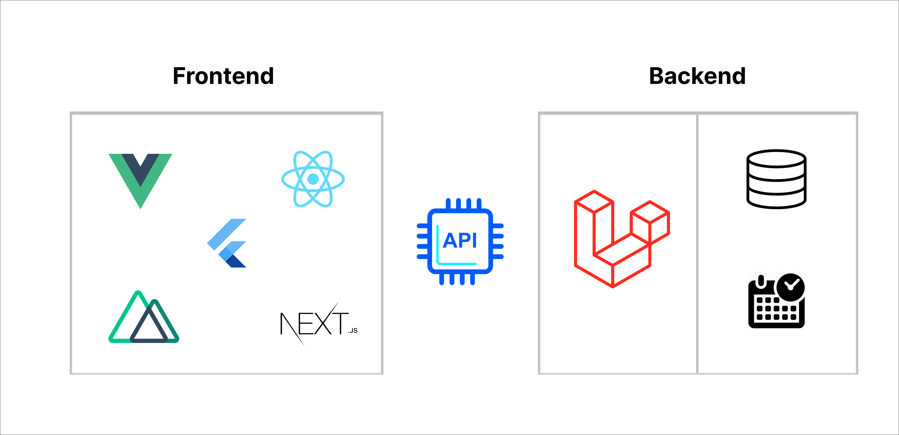

# Nexus Base

As a member of the Nexus Ecosystem, Nexus Base aims to provide a reusable project template.

## Methodology | Architecture | Concepts

Nexus client-server separation architecture

### Laravel - Backend

- eg: 
	- Laravel - api - Vue SPA
	- Laravel - api - mobile

- simple & easy, able to "go to reference"
- avoid

- avoid using global
- avoid using magic/over-simplify

## What is covered ?

- permission-based
